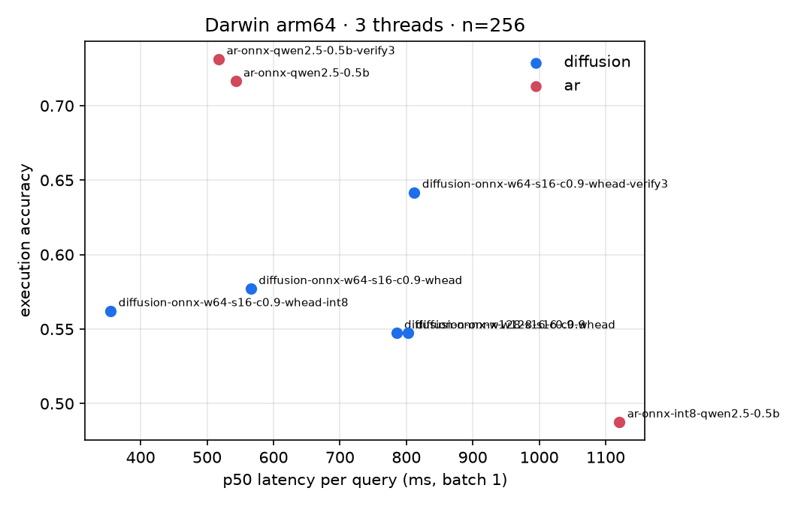

# Fair CPU benchmark: diffusion vs. AR (2026-10-09)

**Question:** On the hardware the playground actually runs on (CPU, ONNX Runtime), how does the ModernBERT diffusion
model compare with an AR model when both get the same engine, threads and eval set? And how much do cheap
inference-time changes help diffusion?

**Setup:** [`bench/`](../../bench/README.md), 256 gretelai test rows, batch 1, ONNX Runtime fp32, 3 threads
(production setting), Apple Silicon (Darwin arm64). Exec accuracy over the 201 rows whose gold SQL runs in SQLite.

| Model | Params | Arm |
|---|---|---|
| ModernBERT-base diffusion (`diffusion-sql-modernbert`) | 150M | masked diffusion, confidence decoding, early stop 0.9, cap 16 steps |
| Qwen2.5-Coder-0.5B AR SFT (`sql-ar-qwen25-coder-0.5b-ar`, from the [Qwen experiment](../2026-07-05_qwen-ar-diffusion/README.md)) | 494M | greedy, KV cache |

The AR model is the one already trained, used here to validate the harness: its exec accuracy over all 256 rows
(0.716 × 201/256 = 0.562) reproduces the Qwen experiment's number exactly. It is 3.3× larger than the diffusion
model, so it is *not* a parameter-matched baseline (see [roadmap](../../docs/roadmap.md), Track B).

## Results

| run | exec | valid | exact | fwd passes | p50 ms | p95 ms | mean ms |
|---|---:|---:|---:|---:|---:|---:|---:|
| **AR** fp32 | **0.716** | 0.805 | 0.355 | 29.9 | 543 | 1395 | 649 |
| AR fp32 + verify | 0.731 | 0.832 | 0.359 | 51.3 | 518 | 4303 | 1038 |
| AR int8 (ORT dynamic) | 0.488 | 0.594 | 0.223 | 36.2 | 1121 | 4866 | 1501 |
| **Diffusion, production config** (window 128) | 0.547 | 0.582 | 0.309 | 9.5 | 803 | 1734 | 863 |
| + MLM head on window only | 0.547 | 0.582 | 0.309 | 9.5 | 785 | 1598 | 819 |
| + window 64 | 0.577 | 0.680 | 0.301 | 9.5 | 566 | 1275 | 621 |
| + int8 weights | 0.562 | 0.645 | 0.305 | 9.3 | **355** | 930 | **415** |
| window 64 + verify (fp32) | 0.642 | 0.797 | 0.312 | 21.8 | 812 | 4603 | 1448 |

## Findings

1. **Cheap changes make diffusion 2.1× faster on CPU** (863 → 415 ms mean), with equal or better accuracy except a
   small int8 cost (−1.5 points exec):
   - *Window 128 → 64* is the biggest single win: −28% latency **and** +3 points exec, +10 points validity. The
     median gold SQL is ~27 tokens; with a 128-token canvas most positions are padding, and the commit schedule
     spreads its budget over them. 32 queries that were invalid at 128 become valid at 64, and 7 break.
   - *Window-only MLM head*: −5%, identical outputs. The head over the prompt positions was wasted work.
   - *int8 dynamic quantization*: −33% on top, small quality cost.
2. **On CPU, AR is still the better trade.** The 3.3× larger AR model matches the fp32 diffusion latency
   (649 vs 621 ms) at +14 points exec. Only int8 diffusion is faster than AR fp32 (415 vs 649 ms), at −15 points.
   This is the compute-bound regime: each diffusion step processes prompt + window (~200 tokens), each AR step
   processes 1 token. A parameter-matched AR model (~150M) would likely be ~3× faster than this one.
3. **int8 via ONNX Runtime's dynamic quantization hurts AR badly** (slower and −23 points exec), so that row is not
   AR at its best on CPU. A fair int8 AR baseline needs llama.cpp (Q8_0), which is not yet benchmarked.
4. **Schema-compile verification is the largest quality lever** for diffusion: +6.5 points exec, +12 points
   validity. AR gains only +1.5 points; its outputs are already mostly valid. The cost is in the tail (p95 4.6 s)
   because sampled retries run the full 16 steps without early stop. Batching retries and keeping early stop
   would cut that.

## Next

- Production: the window-64, window-head and int8 settings can be adopted in the playground (`--max-sql-len` / ONNX
  export) for a ~2× faster demo, at a small accuracy cost from int8.
- Benchmark: add llama.cpp (Q8_0 / fp16) for AR on CPU and run the GPU track (vLLM for AR, CUDA graphs for
  diffusion), plus a parameter-matched AR model.
- Diffusion speed on CPU needs prompt caching (train with a prompt that does not attend to the SQL window) so each
  step processes only the ~64 window tokens instead of ~200.

## Follow-up: prompt isolation without retraining

Prompt caching needs prompt tokens that do not attend to the SQL window (the window still attends to the prompt).
Applying that mask to the *current* model at inference only, as a pessimistic bound
(`--prompt-isolation`, `bench/results/prompt-isolation/`):

| window | exec (full → isolated) | valid | exact |
|---|---|---|---|
| 64 | 0.577 → **0.448** | 0.680 → 0.633 | 0.301 → 0.199 |
| 128 | 0.547 → **0.433** | 0.582 → 0.570 | 0.309 → 0.199 |

At window 64, 35 queries flip from correct to wrong and 9 the other way. The model was trained with full attention,
so every prompt layer now sees inputs it never saw in training; the drop measures that mismatch, not the cost of
the architecture. Whether training *with* the mask closes the gap is the first GPU experiment. Potential payoff:
prompts average 109 tokens, so a cached prompt cuts each step from ~175 to ~66 processed tokens.
